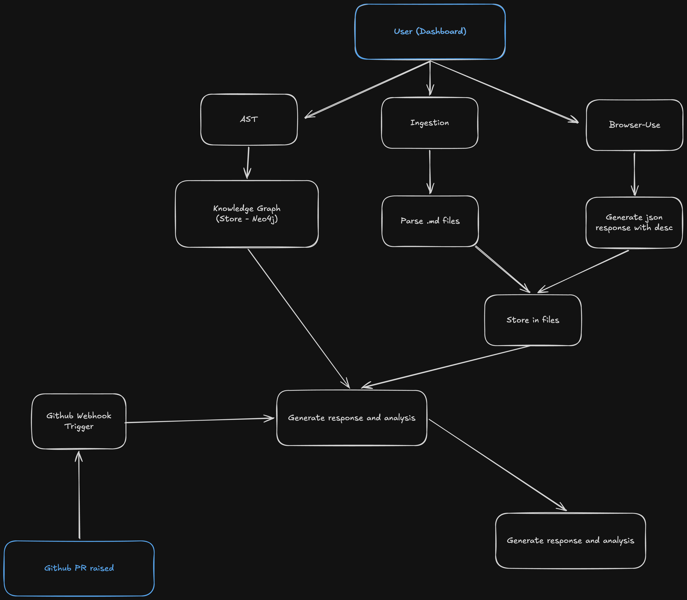

# PullGuard



A testing-intelligence agent that **crawls a live app, ingests a product spec, builds a three-layer knowledge graph (Requirements / UI / Code), and reasons the *blast radius* of a real Pull Request** — posting a non-engineer-readable report back onto the PR.

Built for the Testsigma AI-Engineer take-home (Part A = working system, Part B = design doc).

## Documents — read in this order

1. **[`doc/explainer.md`](doc/explainer.md)** — the plain-English tour for an interviewer or a non-technical stakeholder. Start here for the *what* and *why* without the engineering.
2. **[`doc/design.md`](doc/design.md)** — the design document (Part B): agent decomposition, graph schema, absence modelling, confidence, eval, scope decisions, and what I'd build next. **Opinionated and honest about what's cut.**
3. **[`doc/sample-output.md`](doc/sample-output.md)** — the blast-radius report the system posts on a real PR (`lakug2004-web/TODO` #4), in the form a QA lead reads.

## What's in the repo

```
Assignment/
  doc/                   explainer + design doc + sample output  (Part B)
  backend/               FastAPI, stateless  — AST, descriptions, graph, PR reasoning
  frontend/              Next.js + Prisma/Postgres — dashboard + persistence
  Assignment.pdf         original brief
```

## Architecture (one paragraph)

Two processes, three externals. The **backend** (FastAPI, **stateless**) does the reasoning: Python `ast` parse → LLM descriptions → Neo4j code subgraph → cross-layer connect → PR blast-radius reasoning. The **frontend** (Next.js) **owns all persistence** (crawl runs, requirements, cached AST) and the dashboard, and passes context to the backend per request. Externals: **Neo4j Aura** (the graph), **browser-use cloud** (the crawl), **OpenRouter** (`gpt-4o-mini` for description/ingest, **Gemini 2.5 Flash** for reasoning). Full diagram + the deterministic-vs-LLM split in [`doc/design.md`](doc/design.md).

## End-to-end run

### 0. Prereqs
- Python 3.12 + [`uv`](https://docs.astral.sh/uv/), Node 20+ (or `bun`), Postgres, a Neo4j Aura instance.
- Keys: `OPENROUTER_API_KEY`, `BROWSER_USE_API_KEY`, Neo4j creds, and a **GitHub App** (id + private key + webhook secret) installed on the target repo.

### 1. Backend
```bash
cd backend
# create .env (see the env table in backend/README.md):
#   OPENROUTER_API_KEY, NEO4J_*, BROWSER_USE_API_KEY, GITHUB_APP_ID/PRIVATE_KEY_PATH/WEBHOOK_SECRET
uv sync
uv run uvicorn src.main:app --reload --port 8000
```
Backend env table: [`backend/README.md`](backend/README.md). Without keys the pipeline still runs degraded (AST-only, graph skipped) — by design.

### 2. Frontend
```bash
cd frontend
# create .env: DATABASE_URL/DIRECT_URL (Postgres), backend URL, GitHub OAuth client id/secret
bun install            # or npm install
bunx prisma migrate deploy
bun dev                # http://localhost:3000
```

### 3. Expose the webhook (only to test PR reasoning)

GitHub can't reach `localhost`, so tunnel the PR webhook to your machine. Pick one:

```bash
# Option A — ngrok: public URL → backend :8000
ngrok http 8000
#   → https://<id>.ngrok-free.app  (use this as the GitHub App webhook URL + /webhooks/github)

# Option B — smee: replay GitHub deliveries → frontend route
npx smee-client -u https://smee.io/AbC123 -t http://localhost:3000/api/webhooks/github
#   set the GitHub App webhook URL to the smee channel  https://smee.io/AbC123
```

**Configure the GitHub App webhook** (Settings → Developer settings → GitHub Apps → your app):
- **Webhook URL** = the ngrok HTTPS URL (`…/api/webhooks/github`) **or** the smee channel URL.
- **Webhook secret** = same value as `WEBHOOK_SECRET` in `backend/.env`.
- **Subscribe to events**: `Pull request`. Install the app on the target repo.
- Open/update a PR → GitHub delivers `pull_request` → tunnel → app posts the blast-radius comment.

### 4. Drive the pipeline from the dashboard
1. **Analyze** a repo → builds the Python AST + descriptions + Neo4j **code** subgraph (the AST graph is browsable from the dashboard).
2. **Ingest** a PRD/README/`docs/` → structured **requirements**.
3. **Crawl** → supply an **explicit list of URLs** (deliberate: reproducible, low-hallucination) → captured **screens** + screen-relationship graph.
4. **Connect 3 layers** → writes Requirement + Screen nodes, cross-layer edges, and **absence** (`MISSING_UI_COVERAGE` → `CoverageGap`).
5. **Reason** → open/update a PR on the repo; the GitHub App webhook fires `pr_review`, which posts the **blast-radius** comment.

### 5. See the absence query
In the Aura console:
```cypher
MATCH (r:Requirement {full_name:"lakug2004-web/TODO"})-[:MISSING_UI_COVERAGE]->(:CoverageGap)
RETURN r.req_id, r.title
```

## Showcase

`lakug2004-web/TODO` **PR #4 — "Redesign Streamlit UI"**. The app is a Python to-do engine + a **Streamlit web UI** + a 14-file `docs/` set. PR #4 is a 233-line visual redesign of the UI with **no engine change** — the textbook blast-radius case: PullGuard correctly bounds the impact to the **Presentation layer** (UI + flows at risk, no requirement loses coverage). See [`doc/sample-output.md`](doc/sample-output.md).

## Known limitations (full list in design doc §9.4)

- **Code↔UI linking is Python-only** (`ast.parse`). It closes for this showcase because the UI is **Streamlit (Python)** — the screen and the code that renders it share one AST. Point it at a **React/JS/TS** frontend and the loop falls back to joining through Requirements only. A tree-sitter web AST is the #1 next build.
- Crawler schema/docstrings (`schemas.py`) still describe an **earlier Playwright path**; the live crawler uses browser-use cloud. Stale contract.
- **No numeric confidence, no eval harness, no human-in-the-loop stop** — documented honestly in design doc §7 & §8.
- In-memory job store (single process).