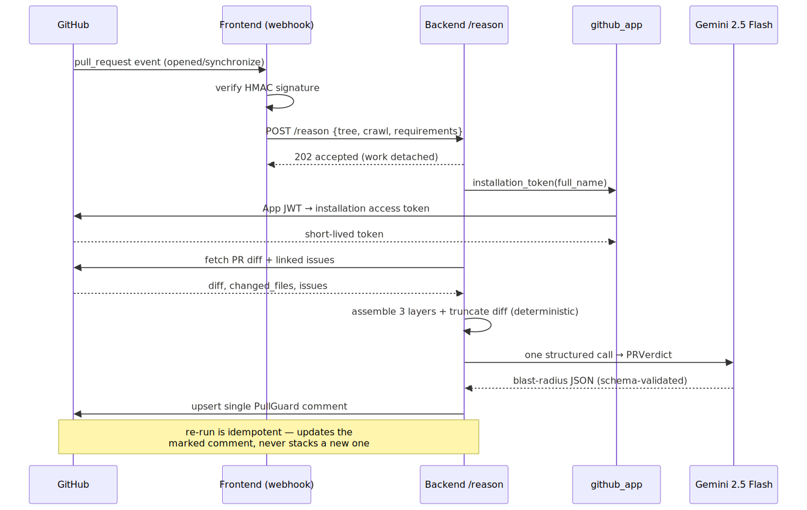

# PullGuard — Design Document (Part B)

**A testing-intelligence agent that crawls a live app, ingests a product spec, builds a three-layer knowledge graph (Requirements / UI / Code), and reasons the *blast radius* of a real Pull Request.**

> Read this alongside the code. Where the code and this document disagree, the code wins and I treat the gap as a bug in the document. I have tried hard not to describe anything as "built" that isn't. Sections that describe *intended* design are labelled **PLANNED — not built**.

---

## 0. System at a glance

PullGuard is two processes plus three external systems:

- **Backend** — FastAPI (Python), **stateless**. Does all the heavy reasoning: AST parse, LLM description, graph writes, PR review. Holds no database; every job's context is passed in on the request.
- **Frontend** — Next.js + Prisma/Postgres. **Owns all persistence** (crawl runs, requirements, cached AST) and the dashboard. It is the system of record; the backend is a pure function over what the frontend hands it.
- **Neo4j Aura** — the knowledge graph. One shared instance; every repo is its own namespaced subgraph.
- **browser-use cloud** — the crawler. We do not drive a browser ourselves.
- **OpenRouter** — two models: `gpt-4o-mini` for high-volume description/ingest, **Gemini 2.5 Flash** for the cross-layer reasoning.



### 0.1 Operator journey through the dashboard

The five stages map to five actions an operator takes from the dashboard, in order. Each is independently re-runnable; only **Connect** and **Reason** require the earlier outputs.



The running example throughout this document is the repo **`lakug2004-web/TODO`, PR #4**. It is a small but real app: a Python to-do **engine** (tasks, priorities, due dates, dependencies, undo/redo, file persistence — 14 tests), a **Streamlit web UI** on top of it (`src/streamlit_app.py`), and a 14-file `docs/` set. **PR #4 is a 233-line visual redesign of that UI with zero engine changes** — the textbook blast-radius case: the look changes everywhere, the logic nowhere. The sample blast-radius report is in [`sample-output.md`](./sample-output.md). (The app started life CLI-only — which is why earlier drafts of this doc used the all-requirements-uncovered absence demo; now that a UI exists, absence is the *narrower, sharper* "which feature has no control" question.)

---

## 5. Agent decomposition

### 5.1 The honest claim first

This is **not one agent loop**. It is a pipeline of five stages, each with a hard boundary, and exactly **one** of them is genuinely agentic (the crawler delegates open-ended browsing to browser-use). The other four are deterministic orchestration wrapped around *bounded, single-purpose* LLM calls. I think that is the right shape for this problem and I will defend it below — but I am not going to dress a chain of prompts up as an "autonomous agent." Calling everything an agent is how you get systems nobody can debug.

### 5.2 The five stages and their boundaries



| # | Stage | Input → Output | Boundary (why it ends here) |
|---|-------|----------------|------------------------------|
| 1 | **Crawl** | route list → `Screen` + `Transition` records | Ends when each supplied URL has one structured screen summary. No discovery beyond the list. |
| 2 | **Ingest** | doc URL/repo → `Requirement[]` | Ends when prose is split + each section is turned into testable requirements. |
| 3 | **Code** | repo tarball → `RepoTree` + Neo4j code subgraph | Ends when AST + descriptions + structural/dependency/call edges are written. |
| 4 | **Connect** | reqs + crawl + file paths → cross-layer edges + gaps | Ends when every requirement is linked (or explicitly marked uncovered). |
| 5 | **Reason** | PR diff + all 3 layers → blast-radius verdict | Ends when one verdict is posted on the PR. |

Stages 1–4 run from the dashboard (each is a separate job/endpoint). Stage 5 is event-driven off the GitHub webhook. The boundaries are real because **each stage persists its output to a store the next stage reads** — they are not function calls chained in memory. You can re-run stage 5 a hundred times without touching stages 1–4. That decoupling is the whole point: the expensive, deterministic graph is built once; reasoning is cheap and repeatable.

### 5.3 Deterministic vs LLM — the actual split

This is the question that matters, so here is the real line, per stage:

| Stage | Deterministic | LLM-driven | Why split there |
|-------|---------------|------------|-----------------|
| Crawl | URL normalisation, screen-id hashing, **screen-relationship graph from `href`s** (`_build_relationships`), screenshot re-hosting | per-screen semantic read (title, label, purpose, actions, components) | Graph topology is a *fact* derivable from links — never ask a model for something `urljoin` can compute. "What is this screen for" is genuinely a judgement. |
| Ingest | fetch, markdown heading split (`_split_sections`), stable `R{n}` id assignment | prose → `{user_action, expected_outcome}` requirements | Splitting on `#` headings is regex. Turning a paragraph into a *testable* requirement is judgement. |
| Code | **`ast.parse`** → symbols, imports, call names; **import resolution** to files; **all edge writes** (`CALLS`/`DEPENDS_ON`/`USES`/`IMPORTS`/`INHERITS_FROM`) | one structured call per file = file + symbol descriptions | The graph *structure* is compiler-grade fact from the Python AST. Only the natural-language *description* is LLM. The model never decides what calls what. |
| Connect | all Cypher writes, the **absence** computation (booleans + `CoverageGap`) | **one** call mapping each requirement → screens + files | Mapping "requirement R3" to "the /todo screen" is semantic and has no deterministic source. But the LLM only *proposes* links; Cypher decides truth, and only ids that exist in the provided lists survive. |
| Reason | PR fetch, diff truncation, layer assembly, comment upsert | **one** call producing the blast-radius verdict | The verdict is the irreducible judgement. Everything feeding it and everything after it is deterministic. |

The principle, stated once: **the LLM decides links and language; Cypher and Python decide truth.** Every LLM output is constrained to a Pydantic schema and validated; anything that references an id/path not in the input is dropped on the floor (`graph_layers.py` lines 200–212). A hallucinated file path cannot enter the graph because the write only matches on `files_set`.

### 5.3.1 Execution trace of the Reason stage

The Reason stage is the most integrated path — event-driven, multi-system, with exactly one LLM call boxed in the middle. The runtime sequence:



Note the shape: everything before and after the single `LLM` arrow is deterministic — token minting, fetch, layer assembly, diff truncation, and the marker-based comment upsert. The model is invoked once, against a context the system fully controls, and its output is validated before it touches GitHub.

### 5.4 Why this isn't "a chain of prompts"

Three concrete reasons:

1. **The graph is the agent's memory, and it is mostly not LLM-authored.** The call graph, dependency graph, and inheritance edges come from `ast`, not a prompt. The reasoning stage reasons *over a structure it can trust*, which is what separates this from "summarise the diff."
2. **The LLM is boxed.** Four of five stages use exactly one or N bounded structured calls with schema validation and id-whitelisting. There is no free-roaming tool-use loop except inside browser-use, where open-ended exploration is the actual job.
3. **Stages are independently re-runnable and degrade independently.** Drop the OpenRouter key and you still get the AST graph and the screen-relationship graph; drop Neo4j and you still get a PR verdict off the diff + cached tree. A prompt chain falls over when any link is missing; this doesn't.

The honest cost of this shape: there is **no global planner**. Nothing reflects on "did stage 3 produce enough for stage 5." Stages are dumb and sequential. For a 16-hour build that is the right trade — a planner is the first thing I'd add only *after* eval exists to tell me it's needed (see §10).

---

## 6. Graph schema with justification

### 6.1 Three layers in one per-repo subgraph

Every node is namespaced by repo `full_name` (keys like `owner/repo:path` or `owner/repo::req::R3`). One Aura instance holds many repos as isolated subgraphs; rebuilding one `DETACH DELETE`s only that repo's reachable nodes. This is the cheapest way to get multi-tenant isolation on the free tier without separate databases.



### 6.2 Node types

| Layer | Node | Key fields | Source |
|-------|------|-----------|--------|
| Code | `Repo` | `full_name`, `summary` | tarball |
| Code | `File` | `path`, `loc`, `description`, `imports` | `ast_parser` + `describer` |
| Code | `Function` (`:Method` if on a class) | `name`, `args`, `calls`, `description` | AST |
| Code | `Class` | `name`, `bases`, `description` | AST |
| Code | `Library` | `name`, `external=true` | resolved imports |
| Code | `Decorator` | `name` | AST |
| UI | `Screen` | `url`, `title`, `label`, `authenticated` | crawl |
| Req | `Requirement` | `req_id`, `title`, `user_action`, `expected_outcome`, **`covered_by_ui`**, **`implemented_in_code`** | ingest |
| **Absence** | **`CoverageGap`** | `reason` | computed |

### 6.3 Edge types

Structure/behaviour (code): `CONTAINS`, `DEFINES`, `HAS_METHOD`, `DEPENDS_ON`, `IMPORTS`, `USES`, `CALLS`, `INSTANTIATES`, `INHERITS_FROM`, `DECORATED_BY`.
Cross-layer: `SPECIFIES`, `HAS_SCREEN`, `NAVIGATES_TO`, `COVERED_BY` (req→screen), `IMPLEMENTED_BY` (req→file), `RENDERED_BY` (screen→file, planned), and `MISSING_UI_COVERAGE` (req→gap).

### 6.4 How absence is modelled — and why it is a node, not a missing row

This is the question the brief calls out, so it gets the most care. Absence is modelled **three ways at once**, deliberately redundant:

1. **Boolean state on the requirement** — `covered_by_ui` / `implemented_in_code`. Absence is a *property*, queryable without traversal.
2. **A first-class `CoverageGap` node** + `(:Requirement)-[:MISSING_UI_COVERAGE]->(:CoverageGap)` edge. Absence becomes *visible in the graph view* — you can literally see the dangling gaps — and gives a place to attach a `reason` and, later, severity/owner.
3. **The default-to-uncovered rule.** If the mapping LLM is absent or unsure, the requirement stays `covered_by_ui=false` and gets a gap. **Absence is the safe default, presence must be proven.** A requirement is only "covered" if the model named a screen that actually exists in the crawl.

Why not just "a requirement with no `COVERED_BY` edge"? Because *missing data and proven-absent look identical* in that model — you can't distinguish "we never ran the crawl" from "we crawled and the feature genuinely isn't there." Making the gap an explicit node lets the absence query return a row that means *something asserted*, and lets the report say "this requirement should be testable and isn't" with confidence.

### 6.5 Justify the schema against a real query

The query the whole system exists to answer — *"which intended behaviours have no way to be tested in the product as built?"*:

```cypher
MATCH (r:Requirement {full_name:$repo})-[:MISSING_UI_COVERAGE]->(:CoverageGap)
RETURN r.req_id, r.title
```

One hop, no joins, index-friendly on `full_name`. On `lakug2004-web/TODO` *before* the Streamlit UI existed this returned **every** requirement (a CLI app exposes no web UI); *after* it, the same query returns the **short, sharp** list of requirements the screens don't surface a control for. The query didn't change — the answer got more useful as the app grew, which is exactly what you want from modelling absence as state rather than as missing rows.

A second query the reasoning stage leans on — *"if this file changes, which requirements lose coverage?"*:

```cypher
MATCH (f:File {key:$repo + ':' + $path})<-[:IMPLEMENTED_BY]-(r:Requirement)
OPTIONAL MATCH (r)-[:COVERED_BY]->(s:Screen)
RETURN r.req_id, r.title, collect(s.label) AS screens_that_test_it
```

This is exactly the code→requirement→screen trace the brief asks for, and the schema gives it in two hops. The edge directions were chosen so this traversal starts from the changed file (the thing a PR gives you) and fans out to impact — not the other way around.

---

## 7. Confidence handling under ambiguity

**Honest status: numeric confidence and an automated human-in-the-loop stop are NOT built.** I am not going to pretend otherwise. Here is what *does* exist today, then what I would build.

### 7.1 What's actually built

Confidence today is **structural and conservative**, not a number:

- **Absence-as-default (§6.4).** When the agent can't map a requirement to a screen, it doesn't guess — it records a gap. Ambiguity resolves *toward "uncovered,"* which is the safe direction for a tool whose job is flagging risk.
- **Id/path whitelisting.** A cross-layer link only survives if the screen/file it names exists in the input (`graph_layers.py`). The model cannot express false confidence in a thing that isn't there.
- **Layer-presence honesty in the output.** The PR comment footer states which of the three layers actually informed it: `✅ Requirements · ⚪ DOM/UI (no crawl) · ✅ Code + graph` (`render_comment`). A non-engineer reading the report can see *what the system was blind to*. That is the most important "confidence" signal in the product right now.
- **Prompt-level honesty instruction.** The reasoner is told to "be honest when a link is uncertain rather than inventing one," and the verdict carries a coarse `risk: low|medium|high`.
- **Graceful degradation as confidence floor.** No key / no graph / no crawl never crashes — it produces a *narrower* report that admits its narrowness.

So the current answer to "what happens when it isn't sure" is: **it widens the gap set, narrows the claim, and tells the reader what it couldn't see.** That is defensible for v1. What it does *not* do is quantify uncertainty or pause for a human.

### 7.2 PLANNED — not built

The right design, which I scoped out for time:

- A **numeric confidence per cross-layer edge** = f(model self-rating, string-match strength between requirement/screen/file names, agreement across N sampled mappings). Store it on the edge.
- **Three explicit stop conditions** that route to a human review queue instead of auto-posting: (a) a `high` risk verdict on a PR touching a file with `IMPLEMENTED_BY` edges to multiple requirements; (b) a requirement the model wants to mark "covered" but whose confidence is below threshold; (c) a changed function that maps to *no* file node at all (the "can't map code to UI" case). 
- Surface confidence in the report as a band, not a decimal, so the QA lead reads "high / needs a human" rather than "0.62."

I'd only build this *after* §8, because without eval I can't calibrate a threshold and would just be inventing numbers.

---

## 8. Eval approach

**Honest status: no eval harness is built.** This is the biggest gap in the submission and I'd rather say so than hide it. Here is how I'd know the output is right, and specifically the "100 runs" answer.

### 8.1 The core problem: the pipeline is non-deterministic where it matters

Stages 1, 2, 4, 5 each contain an LLM call. Re-run the system 100× on the same PR and the *structure* (AST graph, screen-relationship graph) is **bit-identical** — it's `ast` and `urljoin`. The *descriptions, requirement phrasings, cross-layer links, and verdict* will drift. So eval has to treat the two halves differently.

### 8.2 Two-tier eval

**Tier 1 — deterministic invariants (must hold every run, asserted in CI):**

- AST node/edge counts are stable for a fixed commit (regression test on the graph builder).
- Every `COVERED_BY`/`IMPLEMENTED_BY` edge points at an id that exists (no dangling links) — this is the whitelisting invariant, testable directly.
- Absence is complete: `count(uncovered requirements) + count(covered) == count(requirements)`.
- The verdict validates against `PRVerdict`; required fields present.

These catch the failures that actually break the product (broken graph, hallucinated ids, malformed output) and they are 100%-deterministic to check.

**Tier 2 — judgement quality (the LLM outputs):**

- **A small golden set.** For `lakug2004-web/TODO` PR #4 I hand-label: the change is UI-only (`src/streamlit_app.py`), so the correct answer is "UI + flows at risk, no requirement loses coverage, engine untouched." That's a crisp, checkable target. ~5–10 PRs across 2–3 repos is enough to be useful, not enough to be a benchmark — and I'd say that.
- **Metric:** set-level precision/recall of `requirements_at_risk` and `ui_at_risk` vs the golden labels. Absence recall is the headline number (did we catch every uncovered requirement) because false-negatives there are the dangerous failure.
- **Stability under resampling (the 100-runs answer):** run each input **N=10** times, report the *agreement rate* per field (e.g. "R3 flagged in 9/10 runs"). High-agreement claims are trustworthy; low-agreement claims are exactly the ones §7's confidence band should down-rank. **Which runs are "correct" = the ones whose flagged set matches the golden labels; which claims are trustworthy = the ones stable across resamples.** Those are two different questions and the harness answers both.
- **LLM-as-judge** (see §10) for description quality on a rubric (accurate / specific / non-engineer-readable), with a human spot-check on a sample to keep the judge honest.

### 8.3 What I would *not* claim

I would not report a single accuracy number off one repo and call it validated. The TODO app is now a genuinely better target than its CLI days — it has a real web UI where some requirements are covered and some aren't — but it's still *one* app. The system isn't *proven* until the golden set spans several, including a JS/TS frontend (which needs the web-AST work in §10 first).

---

## 9. Scope decisions

The brief is explicit that honest scoping beats polished hand-waving, so here is the real accounting.

### 9.1 What I went deep on

**The Code layer + knowledge graph (deepest).** Full Python `ast` parse → functions/classes/methods/imports, then *resolved* edges: internal imports become `DEPENDS_ON`, imported symbols become `USES`, call names resolve to in-repo `CALLS`, plus `INSTANTIATES`/`INHERITS_FROM`/`DECORATED_BY`. This is compiler-grade structure, not LLM guesswork, and it's what makes the reasoning trustworthy. The per-repo namespacing, idempotent `MERGE` writes, and ten ready-made connector queries are all here. This is the strongest part of the build and I invested there because **the graph is the agent's memory — if it's soft, everything downstream is soft.**

**The Reason stage + real GitHub integration (deep).** This is a working GitHub *App*: RS256 JWT → installation token → fetch PR diff + linked issues → reason across all three layers → upsert a single self-updating comment. It runs on real PRs, not a fixture. The output is framed for a non-engineer (UI at risk / flows affected / requirements losing coverage) with explicit layer-honesty.

### 9.2 What I went medium on

**Ingest / Requirements.** Deterministic heading-split + one bounded LLM call per section into testable `{user_action, expected_outcome}` requirements, plus a whole-doc overview. Solid, but the requirement *granularity* is whatever the doc's headings imply — no merging of duplicate requirements across sections, no priority inference.

### 9.3 What I cut, and why

**The Crawl layer is the thinnest — and it's an outsourced thin.** Two deliberate cuts:

1. **No autonomous exploration.** The crawler takes an **explicit user-supplied list of URLs** (`CrawlRequest.routes`) and visits exactly those. This is a *judgement call, not laziness*: an autonomous crawler that clicks around hallucinates state, loops, and burns budget. Handing browser-use a fixed route list makes the crawl **reproducible and low-hallucination** — every run captures the same screens, and the screen-relationship graph is then derived *deterministically* from real `href`s, not from the model's memory of where it clicked. I'd rather have 8 trustworthy screens than 40 hallucinated transitions.
2. **Browser driving is outsourced to browser-use cloud.** I don't run Playwright myself; I hand browser-use one task per route and take a structured summary back. Cut: I gave up fine control of DOM/a11y capture in exchange for not maintaining a browser harness in 16 hours.

### 9.4 Gaps I found while writing this (you asked me to look)

- **The crawler schema is stale relative to the implementation.** `schemas.py` (`ScreenInfo.structured_dom`, `LoginConfig` storageState) and several docstrings describe an *earlier Playwright + DOM-pruning crawler* that wrote `dom.html`/`a11y.yaml`/`elements.json` (you can see its artifacts under `backend/artifacts/`, e.g. a `netboxlabs.com` run). The current `crawler.py` uses browser-use cloud and does **not** populate those fields. The richer DOM capture is effectively dead code/contract. **Fix: delete the unused fields or re-wire them.**
- **Code↔UI linking depends on the UI's language — it works here, but not generally.** The code layer is **Python-only** (`ast.parse`). For the TODO showcase that's *enough*, because the UI is **Streamlit — also Python** (`src/streamlit_app.py`), so the screen and the code that renders it are in the same AST and `RENDERED_BY` / `IMPLEMENTED_BY` can genuinely connect. **The honest catch:** point this at a normal web app with a React/JS/TS frontend and the loop breaks — the crawl sees the screens, but our AST can't read the code that draws them, so the layers fall back to joining through Requirements only. We chose Python AST because both our backend *and* this app's UI are Python; a JS/TS parser is a second build (see §10.1). So: **the three-layer loop closes for Python UIs and is Requirements-only for JS/TS UIs.**
- **No numeric confidence, no eval harness, no HITL stop** (§7, §8).
- **In-memory job store** (`jobs.py`) — single-process, lost on restart; fine for the demo, needs Redis to scale (already flagged in the code comment).
- **Cross-layer mapping is one LLM call with no self-consistency** — no resampling/voting, so a single bad mapping is unguarded.

I'd rather hand you this list than have you find it.

---

## 10. What I'd build with another week — top 3, in order

### 10.1 A web-app AST (HTML/JS/TS) so Code and UI actually connect — *highest value*

The loop closes today only when the UI is Python (like this app's Streamlit frontend); point it at a normal **React/JS/TS** frontend and "this code change touches *that* screen" breaks, because our AST can't read the code that draws the screens (§9.4). I'd build a second code layer over the frontend with **tree-sitter** (HTML + JS/TS): components, routes, event handlers, and the DOM nodes they render. Then `(:Screen)-[:RENDERED_BY]->(:Component)` becomes a *real* edge for *any* web app and the blast-radius trace runs **code → component → screen → flow → requirement** end-to-end regardless of frontend language. This is first because it's the difference between "works on our Python demo" and "works on a customer's real app." (I have started prototyping an AST around plain HTML/JS for exactly this.)

### 10.2 An eval harness with an LLM judge — *unblocks everything else*

Build §8: the deterministic invariants in CI, the small golden set, set-level precision/recall on the at-risk fields, the N-run agreement metric, and an **LLM-as-judge** scoring (a) the PR description/verdict and (b) the file/requirement descriptions against a rubric, spot-checked by a human. This is second only because §10.1 gives it a real web app to be evaluated *on*. Once this exists I can finally make claims with numbers instead of adjectives, and it's the prerequisite for calibrating §10.3.

### 10.3 Numeric confidence + a human-in-the-loop stop

With eval in place to calibrate thresholds, build §7.2 for real: a confidence score per cross-layer edge (model self-rating × name-match strength × cross-sample agreement), surfaced as a band in the report, and the three stop conditions that route uncertain/high-risk PRs to a human queue instead of auto-approving. Third because it is *worthless without §10.2* — an uncalibrated threshold is just a number I made up.

---

## Appendix A — Stack & responsibility map

| Concern | Where | Det / LLM |
|---------|-------|-----------|
| Crawl a live app | `crawler.py` → browser-use cloud | LLM (browse) + Det (graph) |
| Screen-relationship graph | `crawler.py::_build_relationships` | Det |
| Parse a spec → requirements | `ingest.py` | Det split + LLM extract |
| Python AST → RepoTree | `ast_parser.py`, `core/tree.py` | Det |
| File/symbol descriptions | `describer.py` (LangGraph fan-out) | LLM |
| Code subgraph → Neo4j | `graph.py` | Det |
| Connect 3 layers + absence | `graph_layers.py` | Det writes + 1 LLM map |
| PR blast-radius reasoning | `pr_review.py` | 1 LLM (Gemini 2.5 Flash) |
| GitHub App auth + comment | `github_app.py` | Det |
| Orchestration / jobs | `jobs.py`, `api/routes.py` | Det |
| Persistence + dashboard | Next.js + Prisma/Postgres | — |

## Appendix B — `lakug2004-web/TODO` PR #4 demo

- **App:** Python to-do engine (`src/todoapp/*` — models, service, specifications, commands/undo-redo, events, analytics, file persistence; 14 tests) + a **Streamlit web UI** (`src/streamlit_app.py`) + a 14-file `docs/` set.
- **Requirements** ingested from the `docs/` set (one structured requirement set per doc section).
- **Code layer:** Python AST over the whole repo, including the Streamlit UI file — so for this app the screen→code edge is real (the UI is Python).
- **UI layer:** the running Streamlit app crawled at `localhost:8501`.
- **PR #4** ("Redesign Streamlit UI") — diff is `src/streamlit_app.py` (+233/−106) and `README.md` (+18), **no engine change**. Blast radius is correctly **bounded to the Presentation layer**: UI + flows at risk, no requirement loses coverage.
- Blast-radius comment auto-posted to the PR. Full report: [`sample-output.md`](./sample-output.md).
- Absence query (one hop) now returns only the requirements with no surfaced control — the sharp version of the question, not "everything."
