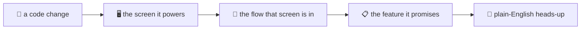

# PullGuard — the plain-English version

*For anyone who wants to get what this thing does without reading code. No jargon, promise.*

---

## The one-liner

**PullGuard reads your app three ways — what it's *supposed* to do, what it *actually looks like*, and how it's *built* — then, every time someone opens a Pull Request, it tells you in plain words what might break.**

Think of it as a really attentive QA teammate who has read the spec, clicked through every screen, *and* read the whole codebase — and who leaves you a short, human note on each PR instead of a wall of red.

---

## Why anyone should care

Code review tools today tell you *"line 42 looks sketchy."* Cool, but that's not the question a QA lead or PM actually has. Their question is:

> "If we ship this change, **what does the user feel?** Which screens, which flows, which promised features are now at risk?"

Nobody answers that today. You find out in prod. PullGuard's whole job is to answer *that* question, **before merge**, in language a non-engineer can act on.

---

## How it thinks (three layers)

We build a little knowledge map of your product with three layers stacked on top of each other:

| Layer | The question it answers | Where it comes from |
|-------|------------------------|---------------------|
| 📋 **Requirements** | What was it *supposed* to do? | the product docs / spec / README |
| 🖥️ **UI** | What did we *actually build*? | a bot that clicks through the live app |
| 🧠 **Code** | *How* is it built under the hood? | reading the actual source code |

Then we connect them. So we can trace a line like:

> *this code → renders this screen → which is part of this user flow → which delivers this promised feature.*

When a PR touches that code, we follow the line the other way and light up everything downstream that could be affected. That chain of lights = the **blast radius**.

---

## The honest bit (the "absence" trick)

Here's the part we're actually proud of.

Most tools only talk about stuff they can see. PullGuard also flags **stuff that's missing** — features the spec *promises* but that **have no screen to test them**. That's a coverage hole, and normally nobody notices a hole because… well, there's nothing there to notice.

We make the hole a *thing*. It shows up in the map as its own marker. So a QA lead can literally ask "show me every promised feature that has no way to be tested" and get a real list back. Holes you can see > holes you trip over.

---

## The demo we ship with

We point it at a real little app: a **to-do app** (`lakug2004-web/TODO`). It's got:
- a proper Python engine (tasks, priorities, due dates, dependencies, undo/redo, save-to-disk),
- a **Streamlit web UI** on top,
- real docs, and real Pull Requests.

We run it on **PR #4**, which is a full visual redesign of that UI — new dashboard, task cards, status pills, filters, charts. *Only the look changes; the engine isn't touched.*

PullGuard's read on it (the short version):
- **UI: high alert.** Basically the whole screen got rewritten — cards, badges, filters, the stats tab. If anything's going to break, it's here.
- **Flows: worth a click-through.** Add a task, complete it, filter, check stats — all still wired to the same engine, but the buttons moved, so smoke-test them.
- **Promised features: safe.** The engine didn't change and its 14 tests still pass, so nothing *logic*-wise loses coverage.
- **Verdict: fine to merge, just click through the UI once first** — because a 233-line UI rewrite ships with no UI tests, only a "does it import" check.

That's the kind of note you can hand to a non-engineer and they *immediately* know what to do. Full version in [`sample-output.md`](./sample-output.md).

---

## What's real vs. what's next (no overselling)

**Works today:**
- Reads the code for real (actual parser, not vibes) and builds the knowledge map.
- Reads the spec into a clean list of features.
- Clicks through a live app and captures the screens.
- Posts a single, self-updating blast-radius note on the PR via a GitHub App.
- Models the "missing coverage" holes as first-class things.

**Not built yet (and we say so):**
- A confidence *score* on each guess (right now it plays it safe instead of quantifying).
- An auto "stop and ask a human" gate.
- A proper scoreboard (evals) to prove accuracy with numbers.

The longer, engineer-facing version of all of this — the trade-offs, what we cut and why — lives in [`design.md`](./design.md). This page was just the friendly tour. 👋
